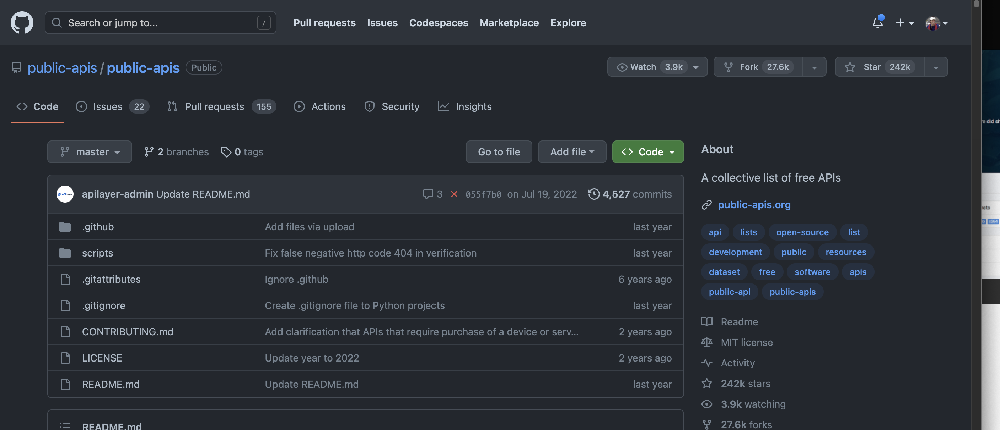

# 9 Default Github Theme Choices

Alter your theme here: https://github.com/settings/appearance. ⭐ = my preference

## Dark
### Dark Dimmed ⭐ 

### Dark Default

### Dark High Contrast

### Dark Protanopia & Deuteranopia

### Dark Tritanopia

## Light
---
### Light Default

### Light High Contrast

### Light Protanopia & Deuteranopia

### Light Tritanopia

